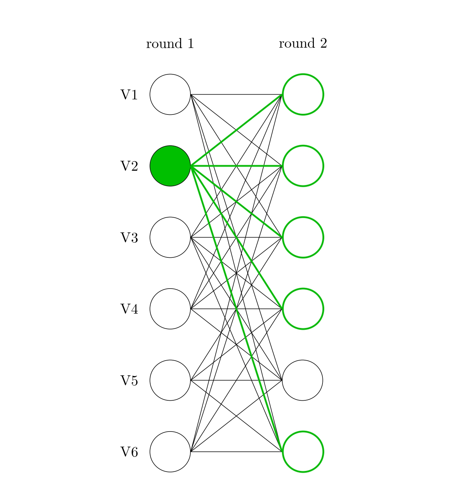

At the heart of every blockchain is a consensus protocol. It’s how the network knows which *block* is next in the *chain*. These protocols face an inherent [trilemma](https://vitalik.eth.limo/general/2017/12/31/sharding_faq.html) between scalability, security, and decentralization. In deciding what consensus protocol to use, each blockchain positions itself within the trilemma. For instance, Bitcoin’s Nakamoto consensus emphasizes security and decentralization at the expense of scalability.

[Odontoceti](https://arxiv.org/abs/2510.01216), the latest in DAG-based consensus, explores the impacts of trading off security for scalability. Specifically, it looks at the speed improvement that follows from reducing the theoretical fault tolerance (the proportion of bad actors a network can withstand) from 33 to 20%. It turns out the resulting protocol is extremely performant! Odontoceti achieves a median latency of 300 milliseconds (0.3 seconds) to finalize a transaction while processing 10,000 incoming transactions per second. Throughout testing, Odontoceti was 20-25% faster than its predecessor, which uses a 33% fault tolerance. Its predecessor, [Mysticeti](https://arxiv.org/abs/2310.14821), is currently used in production in Sui.

## How does Odontoceti Work?

If you are unfamiliar with DAG-based consensus, please see Section 2.9 of the [paper](https://arxiv.org/abs/2510.01216) for some background. Odontoceti, operating in a partially synchronous network, constructs an uncertified DAG, removing the costs of certifying each block before it enters the DAG. While this significantly reduces the messages required to make the DAG, it doesn’t attempt to solve the problem of equivocations (when a participant tries to enter conflicting blocks into the chain). Those are handled by Odontoceti’s decision rule.

The core of the rule is committing a block when it receives support from 80% of participants. This resolves equivocations since two conflicting blocks won’t ever both gain support from 80% of participants. For the full decision rule including correctness proofs, please see the [paper](https://arxiv.org/abs/2510.01216).

The subtlety not highlighted yet is how simple this is. A participant broadcasts their block to the network and upon receiving support from enough peers, the block, along with all of its transactions, is committed. In consensus speak, this commitment takes two rounds. The first is the initial broadcast and the second is when peers support it. Consensus protocols that operate with a 20% fault tolerance are able to commit in two rounds. Protocols that operate with a 33% fault tolerance can only commit after three rounds. This is the heart behind why Odontoceti is so fast.

## Testing Results

Below is a figure showing Odontoceti’s performance in networks of 10 and 50 participants under loads of 10,000 and 50,000 transactions per second. Latency is how quickly blocks are committed. This is equivalent to finalizing transactions and is displayed at the 50th (median) and 90th percentiles.

Odontoceti commits blocks in 300ms with 10 participants and a load of 10,000 transactions per second. With 50 participants and 50,000 transactions per second, median latency increases to 360ms. Tail behavior is reasonable with the 90th percentile lagging the median by no more than 100ms. The tests were conducted across machines spread around the globe, characteristic of distributed blockchains. Pings between machines were predominantly between 100 and 200ms.

These results are 20-25% faster than Mysticeti. Thus, illustrating the practical performance benefits which arise from trading off fault tolerance. Currently, many blockchains, like Sui with Mysticeti, use a 33% fault tolerance. That may be shifting as Solana recently implemented the same trade off that Odontoceti makes with their new consensus protocol [Alpenglow](https://www.anza.xyz/alpenglow-1-1).
